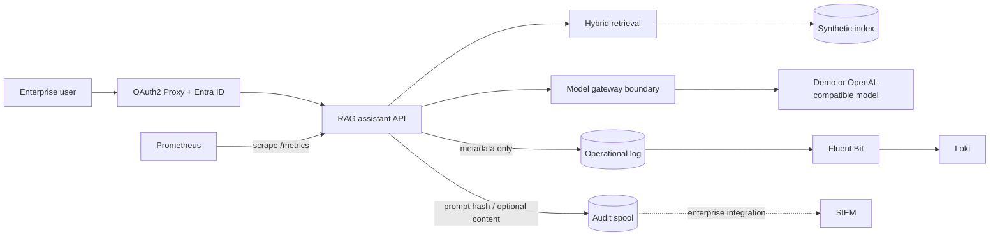

# Secure LLM Platform Reference

A clean-room, runnable reference implementation of the controls that sit between an enterprise user and an LLM: retrieval, model routing, evaluation, operational telemetry, and a separate prompt-audit plane.

> [!IMPORTANT]
> This repository is authored as a public-safe reference. It contains no customer source code, data, infrastructure identifiers, credentials, logs, prompts, or screenshots. The architecture is distilled from production experience; it is not a copy of a customer deployment.

## What this demonstrates

- metadata-scoped hybrid retrieval with deterministic offline embeddings;
- glossary expansion, reranking, and a fallback when reranking reduces query coverage;
- confidence-based grounded refusal and source attribution;
- an explicit gateway boundary with a safe offline demo backend;
- an OAuth2 Proxy front door for Microsoft Entra ID (OIDC) with optional group authorization;
- operational logs that never contain prompts or answers;
- a separate, opt-in prompt-audit stream with hashed actor identifiers;
- repeatable evaluation against a synthetic corpus;
- least-privilege container defaults and isolated observability volumes.

## Architecture



The operational and audit streams use different files and Docker volumes. Fluent Bit can read only the operational volume. See [docs/architecture.md](docs/architecture.md) and [docs/security-model.md](docs/security-model.md).

## Run locally

Requirements: Python 3.12+.

```bash
python3 -m venv .venv
source .venv/bin/activate
python -m pip install -r requirements.lock
python -m ingestion.build_index --source sample-data --output .local/index.json
PYTHONPATH=".:apps/rag-assistant" RAG_INDEX_PATH=.local/index.json \
  uvicorn secure_rag.api:app --host 127.0.0.1 --port 8000
```

Ask a question:

```bash
curl -s http://127.0.0.1:8000/v1/ask \
  -H 'content-type: application/json' \
  -d '{"question":"Who can approve emergency production access?","filters":{"audience":"engineers"}}'
```

The default gateway is deterministic and offline. It makes the repository testable without downloading a model or sending data to a hosted API.

## Run the reference stack

```bash
cp .env.example .env
# Fill Entra/OAuth2 Proxy values in .env before starting the protected stack.
docker compose -f infra/docker-compose.yml up --build
```

- Authenticated entrypoint: <http://127.0.0.1:4180>
- Prometheus: <http://127.0.0.1:9090>
- Loki readiness: <http://127.0.0.1:3100/ready>

The Compose stack binds published ports to loopback. The RAG API has no host port and requires the `X-Forwarded-User` header from OAuth2 Proxy. OAuth2 Proxy validates Microsoft Entra ID tokens and can restrict access with `ENTRA_ALLOWED_GROUP_ID`. The stack does not start an external model by default.

For Entra setup, register a single-tenant web application with redirect URI `http://127.0.0.1:4180/oauth2/callback`, create a client secret, and grant the OAuth2 Proxy app access to the selected security group. See the [OAuth2 Proxy Microsoft Entra ID documentation](https://oauth2-proxy.github.io/oauth2-proxy/configuration/providers/ms_entra_id/).

## Evaluation

```bash
PYTHONPATH=".:apps/rag-assistant" \
  python evals/run.py --index .local/index.json --cases evals/cases.jsonl
```

The evaluator checks expected citations and grounded refusals. The included values are synthetic demonstration results, not customer metrics.

## Verification

```bash
python -m unittest discover -s tests -v
python scripts/pre_publication_check.py
docker compose -f infra/docker-compose.yml config --quiet
```

For customer-specific terms, run the publication check with a local, uncommitted denylist:

```bash
PUBLICATION_DENYLIST_FILE=/absolute/path/to/private-denylist.txt \
  python scripts/pre_publication_check.py
```

## Repository map

```text
apps/rag-assistant/       API and orchestration
gateway/                  model-gateway interface and LiteLLM example
ingestion/                safe corpus loading, chunking, and index build
evals/                    synthetic evaluation cases and runner
observability/            Fluent Bit, Prometheus, and Loki configuration
audit/                    audit event contract and handling guidance
infra/                    local reference deployment
sample-data/              explicitly fictional documents
docs/                     architecture, security model, and ADRs
tests/                    offline unit tests
```

## Scope and limitations

This is a compact reference, not a production distribution. It includes an illustrative Entra/OAuth2 Proxy boundary, but still omits enterprise policy mapping, real SIEM destinations, customer schemas, proprietary prompts, production sizing, and deployment-specific network topology. See [NOTICE.md](NOTICE.md) for provenance and [SECURITY.md](SECURITY.md) for reporting guidance.
